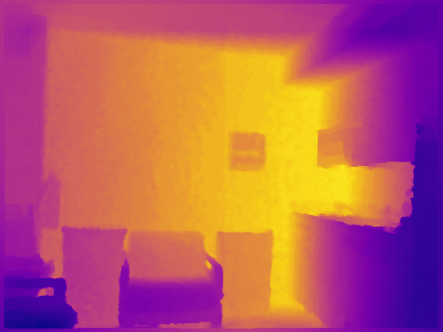
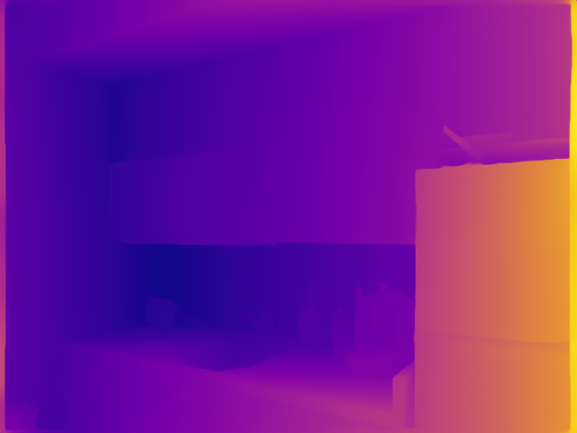

# LightDepth - Lightweight Depth Estimation

LightDepth is a lightweight monocular depth estimation model, built with a ResNet18 encoder-decoder architecture, it demonstrates core concepts of depth estimation from single RGB images without the complexity of production-scale models. The project provides a clear, straightforward implementation ideal for learning about feature extraction, multi-scale processing, and depth prediction in computer vision.

## Features

- **Simple Architecture**: ResNet18 encoder with U-Net style decoder. Uses pretrained ImageNet weights.
- **Easy Training**: Straightforward training script with minimal configuration.
- **L1 Loss**: Simple and effective loss function.
- **Multiple Metrics**: RMSE, MAE, AbsRel, and SqRel metrics.
- **Fast Inference**: 72% faster than Depth Anything V2.
- **Compact Model**: 42% fewer parameters than Depth Anything V2 small (14.3M vs 24.8M).

## Requirements

- Python 3.14
- PyTorch
- CUDA-capable GPU (recommended)

## Installation

Install dependencies either via PDM or pip:

```bash
# Using PDM (Recommended)
pdm install

# Or using pip
pip install -r requirements.txt
```

> [!NOTE]
> You can install `pdm` via `pip install pdm` if you don't have it already.

## Dataset

Download the NYU Depth v2 dataset from [Kaggle](https://www.kaggle.com/datasets/soumikrakshit/nyu-depth-v2).

Place the dataset in `data/nyu/` directory with the following structure:

```text
data/nyu/
├── nyu2_train.csv
├── nyu2_test.csv
├── nyu2_train/
│   ├── *.jpg
│   └── *.png
└── nyu2_test/
    ├── *.jpg
    └── *.png
```

## Pretrained Model

Download the trained model checkpoint from [Google Drive](https://drive.google.com/file/d/1Q19ZCxmZFiOZ1xTXzfxE-kY5_bnEZWWC/view?usp=drive_link).

**Training Infrastructure:**

- GPU: RTX 5080 16GB
- CPU: AMD Ryzen 7 9800X3D
- RAM: 32GB
- OS: Windows 11
- Epochs: 50
- Dataset: NYU Depth v2

## Project Report

For detailed methodology, experiments, and analysis, see: [Project Report](docs/project-report.pdf)

## Usage

### Training

You can train the model from scratch or use a pretrained model from the link above.

```bash
# Using PDM
pdm run python scripts/train.py --config config.yaml

# Or directly with Python
python scripts/train.py --config config.yaml
```

**Options:**

- `--config`: Path to configuration file (default: `config.yaml`)
- `--resume`: Resume training from checkpoint file (optional)

The model saves the best checkpoint to `checkpoints/best_model.pth`.

### Evaluation

Evaluate a trained model on the test set:

```bash
# Using PDM
pdm run python scripts/eval.py --checkpoint checkpoints/best_model.pth --config config.yaml

# Or directly with Python
python scripts/eval.py --checkpoint checkpoints/best_model.pth --config config.yaml
```

> [!NOTE]
> If you downloaded the pretrained model, use its checkpoint path. For example: `--checkpoint checkpoints/lightdepth.pth`

**Options:**

- `--checkpoint`: Path to model checkpoint (required)
- `--config`: Path to configuration file

### Inference

Run inference on a single image:

```bash
# Using PDM
pdm run python scripts/infer.py --checkpoint checkpoints/best_model.pth --input image.png --output depth.png

# Or directly with Python
python scripts/infer.py --checkpoint checkpoints/best_model.pth --input image.png --output depth.png
```

> [!NOTE]
> If you downloaded the pretrained model, use its checkpoint path. For example: `--checkpoint checkpoints/lightdepth.pth`

**Options:**

- `--checkpoint`: Path to model checkpoint (required)
- `--input`: Path to input RGB image (required)
- `--output`: Path to save depth map (default: `output/depth.png`)
- `--colormap`: Colormap for visualization (`plasma`, `viridis`, `magma`, `inferno`, `gray`). Use `gray` for grayscale output.

### Comparison with Depth Anything V2

Compare LightDepth with Depth Anything V2:

```bash
pdm run python scripts/compare.py --config config.yaml --checkpoint checkpoints/best_model.pth
```

> [!NOTE]
> If you downloaded the pretrained model, use its checkpoint path. For example: `--checkpoint checkpoints/lightdepth.pth`

**Options:**

- `--config`: Path to configuration file
- `lightdepth-checkpoint`: Path to LightDepth model checkpoint (required)
- `--dav2-model`: Depth Anything V2 model. Applicable options: `depth-anything/Depth-Anything-V2-Small-hf`, `depth-anything/Depth-Anything-V2-Base`, `depth-anything/Depth-Anything-V2-Large` (default: `depth-anything/Depth-Anything-V2-Small-hf`)
- `--output`: Path to save comparison results JSON (default: `output/comparison_results.json`)
- `--visualize`: Number of samples to visualize (0 to disable)

## Configuration

Edit `config.yaml` to change training settings:

```yaml
# Data settings
data_root: data/nyu  # Path to NYU Depth v2 dataset
img_height: 480      # Output and preprocessed image height (pixels)
img_width: 640       # Output and preprocessed image width (pixels)

# Training settings
batch_size: 32       # Batch size for training
num_epochs: 50       # Number of training epochs
learning_rate: 0.0001  # Learning rate (1e-4)

# System settings
num_workers: 4       # Number of dataloader workers
device: cuda         # Device: 'cuda' or 'cpu'

# Resume training 
resume_from: null  # Path to checkpoint to resume from, or null to start fresh

checkpoint_frequency: 5  # Save checkpoint every 5 epochs (set to 0 to disable)
```

## Project Structure

```text
lightdepth/
├── src/lightdepth/
│   ├── models/          # Model architectures
│   │   ├── encoder.py   # ResNet18 encoder
│   │   ├── decoder.py   # U-Net decoder
│   │   └── lightdepth.py # Complete model
│   ├── data/            # Data loading
│   │   ├── dataset.py   # NYU dataset
│   │   ├── dataloader.py # DataLoader
│   │   └── transforms.py # Data augmentations
│   └── utils/           # Utilities
│       ├── config.py    # Configuration
│       ├── losses.py    # L1 loss
│       └── metrics.py   # RMSE metric
│       └── visualization.py # Visualization utilities
├── scripts/
│   ├── train.py         # Training script
│   ├── eval.py          # Evaluation script
│   ├── infer.py         # Inference script
│   └── compare_models.py       # Comparison script with Depth Anything V2
├── config.yaml          # Default training and inference configuration
├── requirements.txt     # Python dependencies for pip
└── pyproject.toml       # Python dependencies for PDM
```

## Model Architecture

- **Encoder**: ResNet18 (pretrained on ImageNet)
- **Decoder**: 4-stage upsampling with skip connections
- **Channels**: [64, 64, 128, 256, 512] → [256, 128, 64, 32] → 1
- **Loss**: L1 (Mean Absolute Error)
- **Metrics**: RMSE, MAE, AbsRel, SqRel

[](docs/images/model_architecture.png)

## Results

### Quantitative Comparison

LightDepth vs Depth Anything V2 on NYU Depth v2 test set:

| Metric | LightDepth | Depth Anything V2 | Winner |
|--------|------------|-------------------|--------|
| **Parameters** | 14,330,369 | 24,785,089 | **LightDepth (42% fewer)** |
| **RMSE** ↓ | 2.9477 | 2.8074 | Depth Anything V2 (5.0%) |
| **MAE** ↓ | 2.6758 | 2.2360 | Depth Anything V2 (19.7%) |
| **Absolute Relative Error** ↓ | 0.9724 | 1.0272 | **LightDepth (5.3%)** |
| **Squared Relative Error** ↓ | 2.6063 | 3.7849 | **LightDepth (31.1%)** |
| **Total Inference Time** ↓ | 5 seconds | 18 seconds | **LightDepth (72.2% faster)** |

**Key Findings:**

- LightDepth achieves competitive performance with 42% fewer parameters
- Significantly faster inference time (72% improvement)
- Better performance on relative error metrics
- Slight trade-off in absolute error metrics (RMSE, MAE)

### Qualitative Results

Sample depth predictions on NYU Depth V2 test set:

#### Sample 1

| Input | Ground Truth | LightDepth | Depth Anything V2 |
|-------|--------------|------------|-------------------|
|  |  |  |  |

#### Sample 2

| Input | Ground Truth | LightDepth | Depth Anything V2 |
|-------|--------------|------------|-------------------|
|  |  |  |  |

#### Sample 3

| Input | Ground Truth | LightDepth | Depth Anything V2 |
|-------|--------------|------------|-------------------|
|  |  |  |  |

## License

This project is licensed under the MIT License - see the [LICENSE](LICENSE) file for details.

## Author

- Sukhrobbek Ilyosbekov
- CS 7180 Advanced Perception

## Citation

If you use LightDepth in your research or project, please cite:

```bibtex
@misc{lightdepth2025,
  title={LightDepth: Lightweight Depth Estimation},
  author={Sukhrobbek Ilyosbekov},
  year={2025},
  url={https://github.com/suxrobGM/lightdepth}
}
```

This project was inspired by and compared against **Depth Anything V2**:

```bibtex
@article{depth_anything_v2,
  title={Depth Anything V2},
  author={Yang, Lihe and Kang, Bingyi and Huang, Zilong and Zhao, Zhen and Xu, Xiaogang and Feng, Jiashi and Zhao, Hengshuang},
  journal={arXiv:2406.09414},
  year={2024},
  url={https://arxiv.org/abs/2406.09414}
}
```


